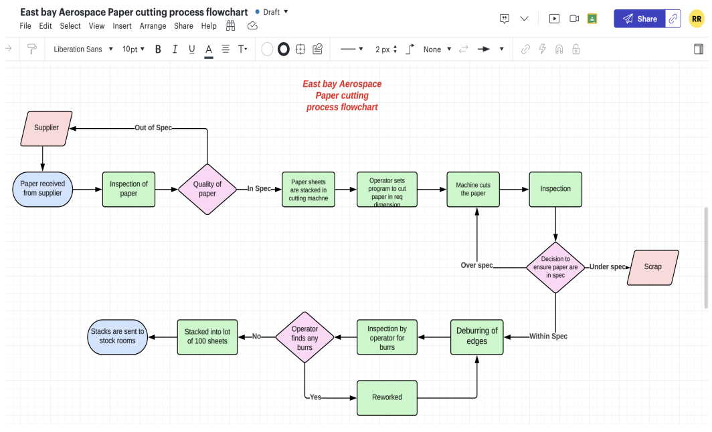
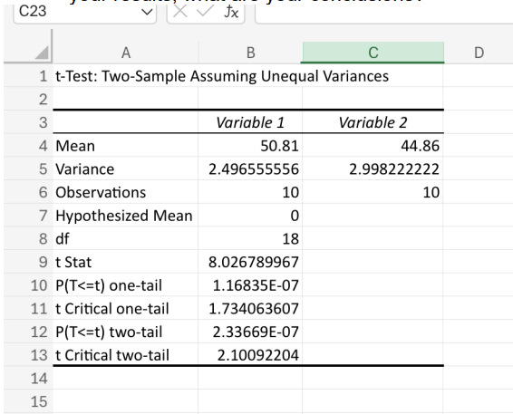
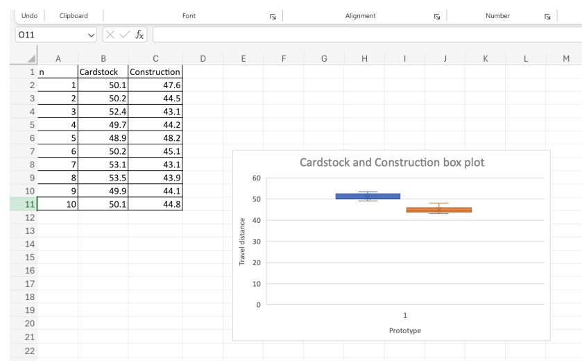
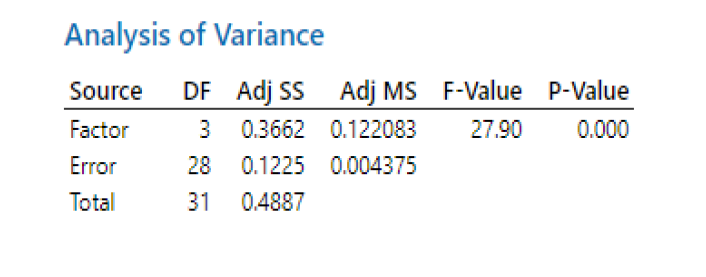
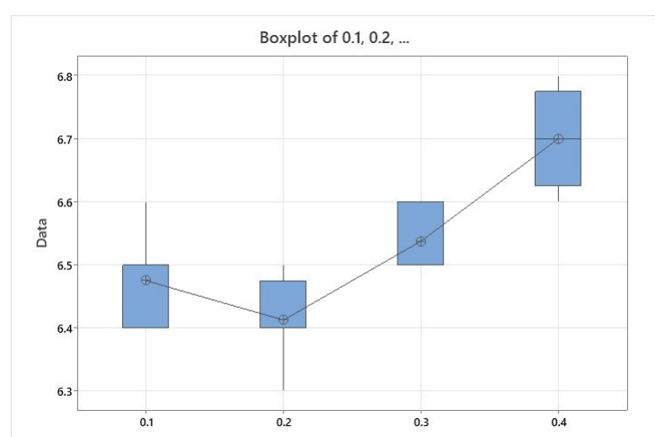
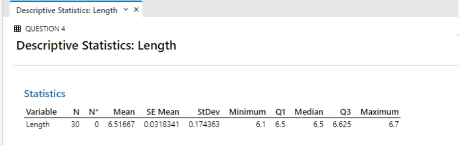

# Quality-and-Reliability
# Quality Management Project
(Simulated Quality & Reliability Analysis Project)

#  East Bay Aerospace – Quality & Reliability Analysis 

**Tools Used:** Excel, Minitab  
**Files in Repository:**  
- `Excel_Data.pdf` – Statistical analysis and outputs  
- `Eastbay_Project.mpx` – Minitab project file  

---

## 🧭 Project Overview

East Bay Aerospace Inc. manufactures paper airplanes and aims to optimize quality, reduce variability, and identify cost-saving opportunities for its new **H57 paper airplane**.  
This project applies **Quality and Reliability Management principles** to analyze manufacturing process data, evaluate material performance, and recommend data-driven improvements.

---

## 🎯 Objectives

This project integrates **statistical process control (SPC)** and **Lean Six Sigma** tools to improve the H57 airplane’s production quality and efficiency.

### Detailed Objectives:
1. **Evaluate Material Performance**  
   Identify which paper material — *Cardstock* or *Construction paper* — yields the longest flight distance using a **two-sample t-test**.  
   This supports material selection and product performance optimization.

2. **Analyze Process Variation at Different Cutting Speeds**  
   Examine how cutting speeds (0.10, 0.20, 0.30, and 0.40 in/sec) affect paper sheet length accuracy using **One-Way ANOVA**.  
   This determines the most consistent speed for dimensional precision.

3. **Quantify Process Capability and Cost of Poor Quality (COPQ)**  
   Assess the **percentage of sheets within spec (6.5 ± 0.2 in)** and estimate **daily rework and scrap costs** using descriptive statistics and Z-scores.  
   This converts process inefficiencies into measurable financial impact.

4. **Establish Data-Driven Process Recommendations**  
   Synthesize hypothesis testing and cost analysis results to recommend an **optimal material and cutting speed**, balancing quality, cost, and efficiency.

5. **Strengthen Quality Planning in Early Design Phases**  
   Highlight the importance of integrating **quality assurance tools** in early product and process design to prevent defects and ensure customer satisfaction.

---

## 🧩 Process Flow Diagram

The cutting process flow was mapped to illustrate the complete path from raw material receipt to finished sheet storage.  
It includes inspection, cutting, rework, deburring, and quality verification steps.

 **Process Flowchart**  


---

## 🎯1 – Material Comparison (Cardstock vs. Construction Paper)

### **Objective**
Determine whether paper material type affects flight distance.

### **Methodology**
- Test: **Two-Sample t-Test (Unequal Variances)**  
- α = 0.05  
- H₀: μ(Cardstock) = μ(Construction)  
- H₁: μ(Cardstock) ≠ μ(Construction)  
- Tool: Excel  

📈 **t-tEST**  


### **Dataset Summary**
| Material | Mean (ft) | Variance | Observations |
|-----------|------------|-----------|---------------|
| Cardstock | 50.81 | 2.50 | 10 |
| Construction | 44.86 | 3.00 | 10 |

### **Excel Output**
- t-Statistic = 8.03  
- p-Value = 2.33 × 10⁻⁷  
- Decision: **Reject H₀**  

✅ **Conclusion:**  
Cardstock has a significantly higher mean travel distance than construction paper.  
It is the recommended material for final design.

📊 **Material Comparison Graph**  


---

## 🎯2 – Effect of Cutting Speed on Sheet Length

### **Objective**
Identify whether different cutting speeds impact mean cut length accuracy.

### **Methodology**
- Test: **One-Way ANOVA**  
- α = 0.05  
- Factor: Cutting Speed (0.10, 0.20, 0.30, 0.40 in/sec)  
- Response: Cut length (inches)  
- Tool: Minitab  

### **Minitab ANOVA Results**
| Source | DF | Adj SS | Adj MS | F-Value | P-Value |
|---------|----|--------|--------|----------|----------|
| Cutting Speed | 3 | 0.3662 | 0.1221 | 27.90 | 0.000 |
| Error | 28 | 0.1225 | 0.0044 |  |  |

📈 **Analysis of Variance**



✅ **Conclusion:**  
Since p < 0.05, cutting speed significantly affects cut length.  
Recommended optimal speeds: **0.10 in/sec** or **0.30 in/sec** for best in-spec control.

📈 **Cutting Speed Analysis Graph**  


---

## 🎯3 – Process Capability & Cost of Poor Quality

### **Objective**
Evaluate process performance at 0.30 in/sec and calculate daily rework and scrap cost.

### **Results Summary**
| Metric | Value |
|--------|--------|
| Mean (μ) | 6.517 in |
| Std. Dev (σ) | 0.174 in |
| Specification | 6.5 ± 0.2 in |
| % Within Spec | 74.75% |
| % Out of Spec | 25.25% |

### **Cost Impact**
| Type | Formula | Result |
|------|----------|---------|
| Rework Cost | 0.2525 × 1500 × $1 | **$378.75/day** |
| Scrap Cost | 0.2525 × 1500 × $5 | **$1,893.75/day** |

📊 **Process Capability Visualization**  


### **Z-Score Code Snippet**
```python
# Process capability and cost calculation example

mean = 6.517
sd = 0.174
spec_low = 6.3
spec_high = 6.7
production = 1500

Z_lower = (spec_low - mean) / sd   # ≈ -1.25
Z_upper = (spec_high - mean) / sd  # ≈ 1.05

# Probability within specification (using Z-table)
P_within = 0.8531 - 0.1056
P_out = 1 - P_within

# Costs
rework_cost = P_out * production * 1
scrap_cost = P_out * production * 5
